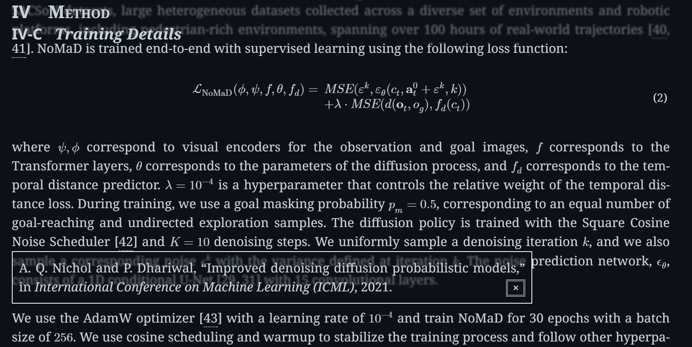

# ar5iv Plus

Enhance ar5iv with various tweaks and improvements.

- [UserStyles.World](https://userstyles.world/style/18946) 
- [GitHub](https://github.com/PRO-2684/gadgets/raw/main/ar5iv_plus/) 

## 🪄 Features & Configuration

- `Sticky Header`: Maximum header level to make sticky. Set to 0 to disable.
- `Semi Transparent`: Makes the sticky header and references preview slightly blurred and transparent.
- `Compact`: Makes captions and references preview more compact.
- `Copy Fix`: Marks certain serial numbers as non-copyable.
- `Z-Index Fix`: Makes active figures always on top.

## 🖼️ Screenshot

