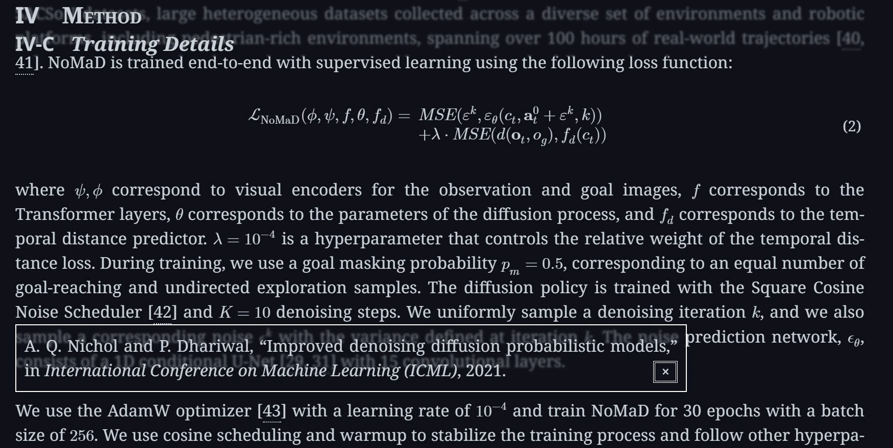

# ar5iv Plus

增强 ar5iv 的各种调整和改进。

- [UserStyles.World](https://userstyles.world/style/18946) 
- [GitHub](https://github.com/PRO-2684/gadgets/raw/main/ar5iv_plus/) 

## 🪄 功能和配置

- `Sticky Header`: 标题浮动的最大层级。设置为 0 以禁用。
- `Semi Transparent`: 使浮动标题和参考文献预览略微模糊和透明。
- `Compact`: 使说明文字和参考文献预览更紧凑。
- `Copy Fix`: 将部分序号标记为不可复制。
- `Z-Index Fix`: 使活动图像始终处于顶部。

## 🖼️ 截图

