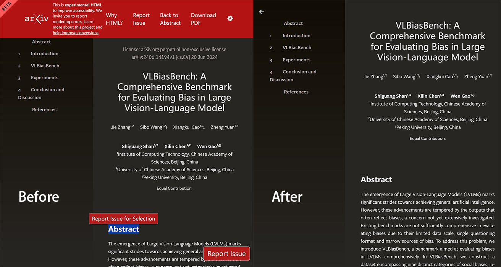

# arXiv HTML Debloat

Hides unnecessary elements on `arxiv.org/html/*`, giving you a clean view.

- [UserStyles.World](https://userstyles.world/style/16559) 
- [GitHub](https://github.com/PRO-2684/gadgets/raw/main/arxiv_html_debloate/) 

## 🪄 Features & Configuration

- `Hide "Report Issue"`: Hides the "Report Issue" button present on the bottom right corner of the page.
- `Hide "Report Issue for Selection"`: Hides the "Report Issue for Selection" button that appears when you select some text.
- `Hide Beta banner`: Hides the beta banner on the top left corner of the page.
- `Hide License and Watermark`: Hides the license and watermark before the actual content.
- `Hide Header`: Hides the big red header of the page.

