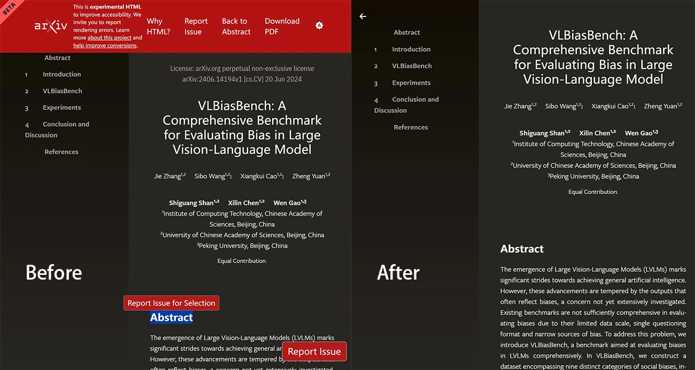

# arXiv HTML Debloat

隐藏 `arxiv.org/html/*` 上的不必要元素，让您获得干净的阅读体验。

- [UserStyles.World](https://userstyles.world/style/16559) 
- [GitHub](https://github.com/PRO-2684/gadgets/raw/main/arxiv_html_debloate/) 

## 🪄 功能 & 配置

- `Hide "Report Issue"`: 隐藏页面右下角的 "Report Issue" 按钮。
- `Hide "Report Issue for Selection"`: 隐藏选中文本后出现的 "Report Issue for Selection" 按钮。
- `Hide Beta banner`: 隐藏页面左上角的 beta 横幅。
- `Hide License and Watermark`: 隐藏正文前的许可证和水印。
- `Hide Header`: 隐藏页面顶部的大型红色标题。

