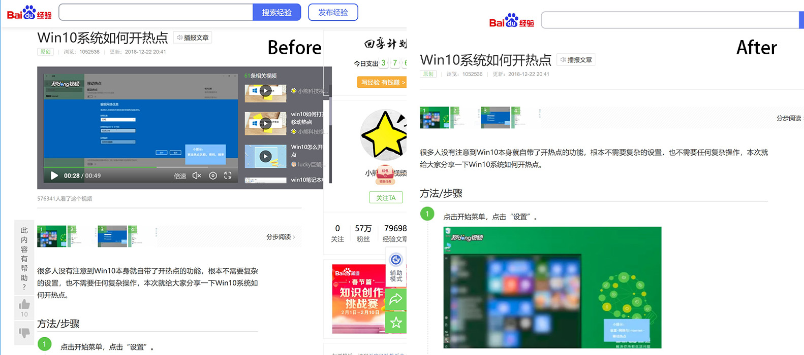

# Baidu Debloate

隐藏百度百科、百度经验和百度贴吧的一些垃圾玩意儿。

- [UserStyles.World](https://userstyles.world/style/17133/debloat) 
- [GitHub](https://github.com/PRO-2684/gadgets/raw/main/baidu_debloate/) 

## 功能 & 配置

- `[通用] 隐藏秒懂百科`: 隐藏百度百科和百度经验上出现的的秒懂百科。
- `[通用] 隐藏顶栏`: 隐藏百度百科、百度经验、百度贴吧的顶栏。
- `[通用] 隐藏导航栏`: 隐藏百度百科、百度经验、百度贴吧的导航栏。
- `[通用] 隐藏活动/广告`: 隐藏百度百科、百度经验、百度贴吧的活动/广告。
- `[通用] 隐藏相关推荐`: 隐藏百度百科的相关搜索、百度经验的相关经验、百度贴吧的贴吧热议榜。
- `[通用] 隐藏辅助模式`: 隐藏百度经验和百度贴吧的辅助模式按钮。
- `[通用] 隐藏浮动工具条`: 完全隐藏百度经验、百度贴吧的浮动工具条。
- `[经验] 完全隐藏侧栏`: 隐藏百度经验的侧栏，同时使主要内容宽屏。
- `[贴吧] 隐藏气泡`: 隐藏百度贴吧帖子的气泡背景。
- `[贴吧] 隐藏快捷键提示`: 隐藏百度贴吧右下角的快捷键提示。

