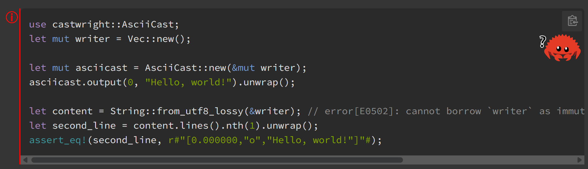
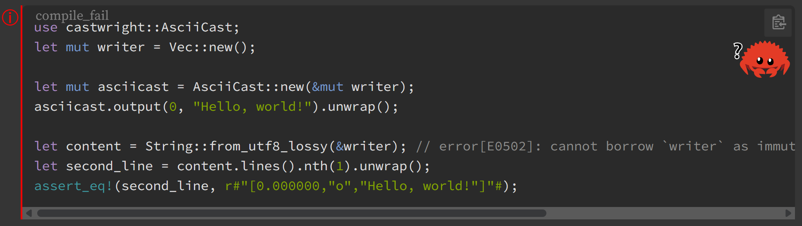

# Docs.rs Ferris

Show Ferris the crab on `docs.rs` code examples, just like on the Rust book.

## List of Ferris

> From [The Rust Book](https://doc.rust-lang.org/book/ch00-00-introduction.html#how-to-use-this-book:~:text=This%20code%20does%20not%20compile!)

| Ferris | Shortcode | Meaning |
| ------ | --------- | ------- |
|  | `does_not_compile` | This code does not compile! |
|  | `panics` | This code panics! |
|  | `not_desired_behavior` | This code does not produce the desired behavior. |

## Details

Here's a list of rustdoc attributes and their corresponding Ferris:

| Attribute | Ferris | When |
| --------- | ------ | ---- |
| [`should_panic`](https://doc.rust-lang.org/rustdoc/write-documentation/documentation-tests.html#:~:text=fn%20foo()%20%7B%0A///%20%60%60%60-,should_panic,-tells%20rustdoc%20that) | `panics` | Always |
| [`compile_fail`](<https://doc.rust-lang.org/rustdoc/write-documentation/documentation-tests.html#:~:text=world%22)%3B%0A///%20%7D%0A///%20%60%60%60-,compile_fail,-tells%20rustdoc%20that>) | `does_not_compile` | Always |
| [`ignore`](https://doc.rust-lang.org/rustdoc/write-documentation/documentation-tests.html#:~:text=The-,ignore,-attribute%20tells%20Rust) | `not_desired_behavior` | If **Show Ferris on `ignore`** is enabled |
| [`no_run`](https://doc.rust-lang.org/rustdoc/write-documentation/documentation-tests.html#:~:text=The-,no_run,-attribute%20will%20compile) | `not_desired_behavior` | If **Show Ferris on `no_run`** is enabled |

## Configurations

### Show attributes

Show the attribute above the code block. Only supports attributes mentioned in the [Details](#details) section.

### Show Ferris on `ignore`

Show `not_desired_behavior` Ferris on `ignore` attributes.

### Show Ferris on `no_run`

Show `not_desired_behavior` Ferris on `no_run` attributes.

### Opacity

Configure the opacity of Ferris.

### Size

Configure the size of Ferris.

### Right offset

Configure the right offset of Ferris.

### Top offset

Configure the top offset of Ferris.
