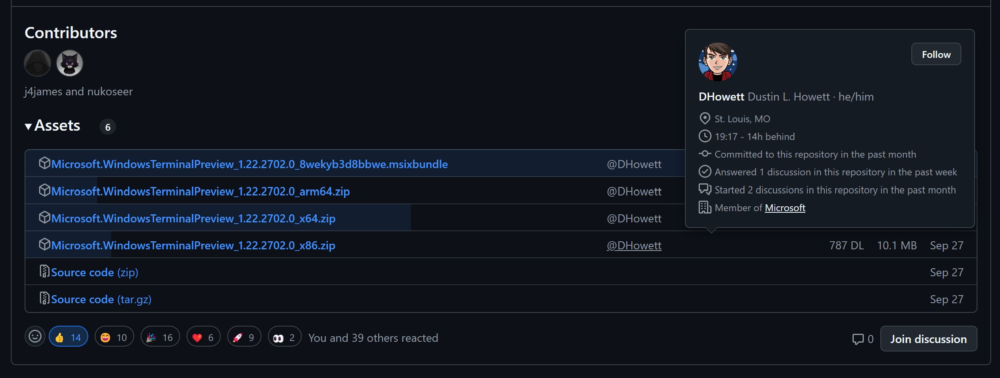
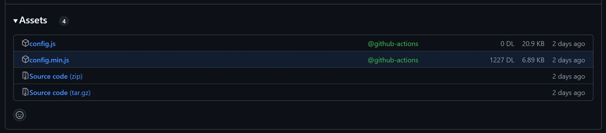
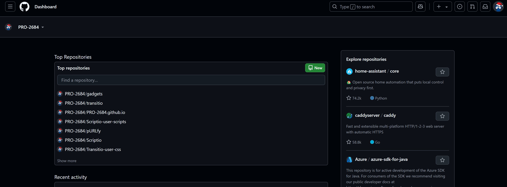
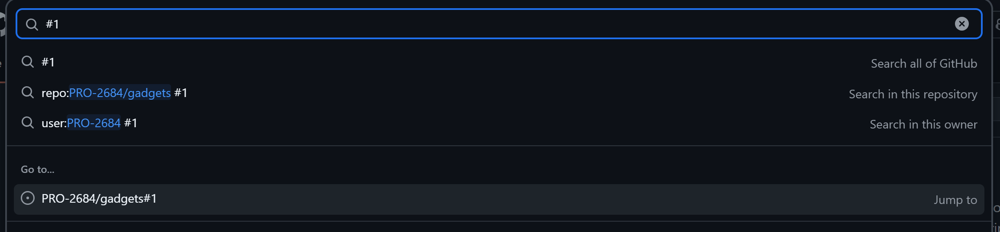
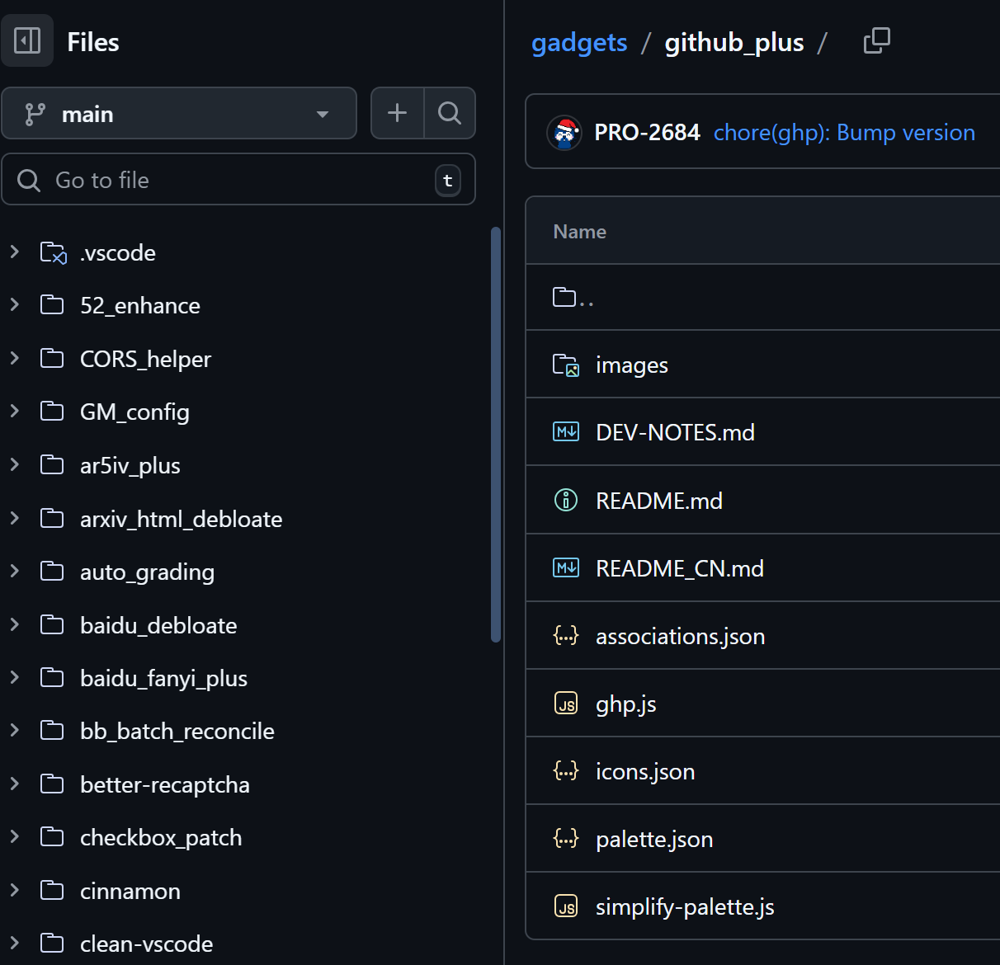
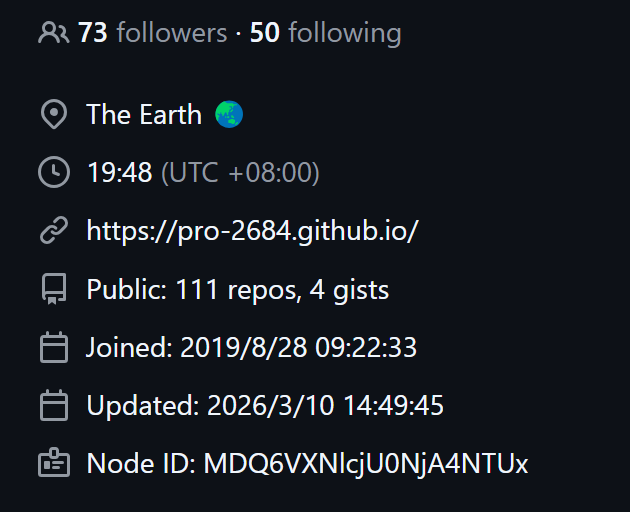
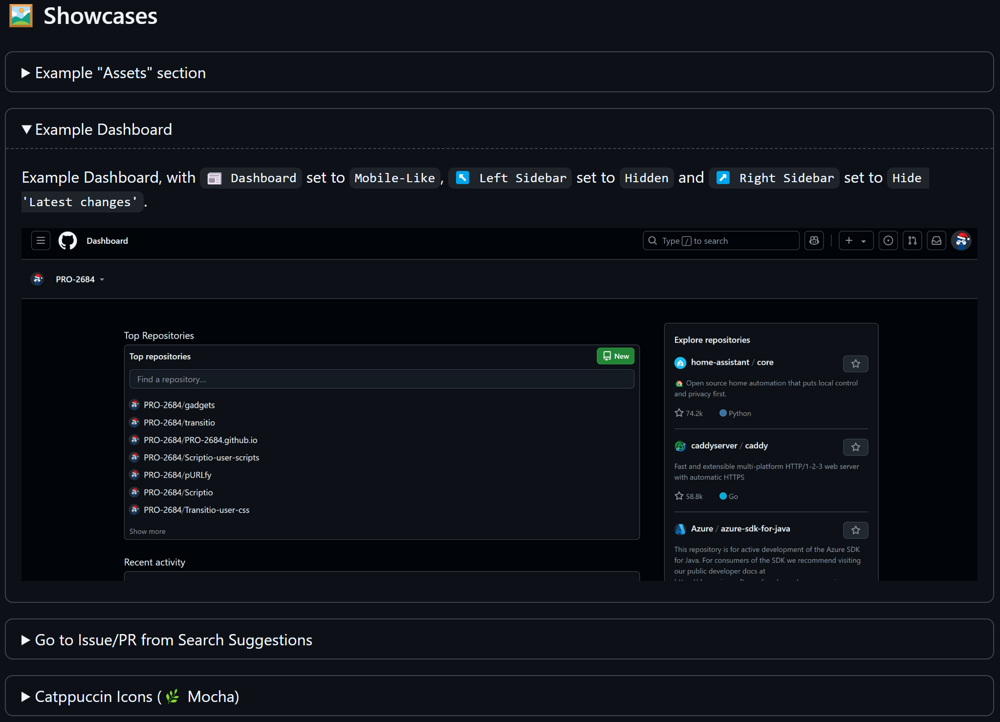
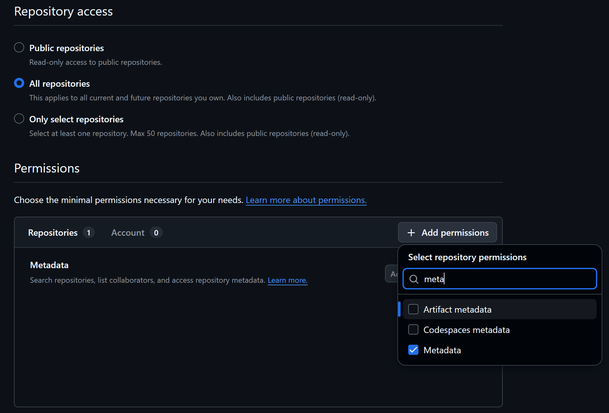

 

> If you encounter issues reading Greasy Fork's README, please visit the [README on GitHub](https://github.com/PRO-2684/gadgets/blob/main/github_plus/README.md) for a better experience.

## 🪄 Features

- No use of `MutationObserver` or `setInterval`, purely event-driven, making it more efficient than scripts of similar functionality
- No dangerous monkey patching, ensuring compatibility
- Experimental support for all GitHub mirrors
    - You need to add the mirror site to **this script's `User matches` list**
    - `Dashboard` - `Installed Userscripts` - `GitHub Plus` - `Settings` - `Includes/Excludes` - `User matches` - `Add...`

## ⚙️ Configuration

- **🔢 Code Features**
    - **➡️ Tab Size**: Set Tab indentation size.
    - **😉 Cursor Blink**: Enable cursor blinking.
    - **🌊 Cursor Animation**: Make cursor move smoothly.
    - **🔲 Full Width**: Make the code block full width (other buttons may cover the end of the line).
    - **🫥 Hide Readonly Tip**: Hide the 'Code view is read-only.' tip in code blocks.
- **🎨 Appearance**
    - **📰 Dashboard**: Configures the dashboard. (`Default`, `Hide Copilot`, `Hide Feed`, `Mobile-Like`)
    - **↖️ Left Sidebar**: Configures the left sidebar. (`Default`, `Hidden`)
    - **↗️ Right Sidebar**: Configures the right sidebar. (`Default`, `Hide 'Latest changes'`, `Hide 'Explore repositories'`, `Hide Completely`)
    - **📌 Sticky Avatar**: Make the avatar sticky. (Experimental, does not work for all avatars)
    - **🫥 Hide Header Underline**: Hide the underline of the header. (the border below the header)
    - **🐱 Catppuccin Icons**: Use [catppuccin icons](https://github.com/catppuccin/web-file-explorer-icons/) for folders and files (HIGHLY EXPERIMENTAL, need refresh to apply changes)
        - Does not update icons when expanding folders at the sidebar.
    - **👀 Visible Details**: Apply indent and borders around `
` elements to make them more visible
- **📦 Release Features**
    - **⬆️ Release Uploader**: Show uploader of release assets.
        - Shows a user hover card on hover if the uploader is a user.
        - Colored as green if the uploader is a GitHub App.
    - **📥 Release Downloads**: Show download counts of release assets.
    - **📊 Release Histogram**: Show a histogram of download counts for each release asset.
        - Does not show up if there is only zero or one release asset.
        - Does not show up if none of the release assets have been downloaded.
    - **🫥 Hide Archives**: Hide source code archives (zip, tar.gz) in the release assets. (Experimental)
- **🔍 Extended Search**
    - **🚀 Go To**: Add items for going to repositories, issues etc. in search suggestions, like:
        - `@owner`: go to owner's profile
        - `/repo`: go to repository of current owner (if any)
        - `owner/repo`: go to repository
        - `@owner/repo#123`: go to issue/PR number 123 in the repository
        - `#123`: go to issue/PR number 123 in the current repository (if any)
- **🪄 Additional Features**
    - **👤 Extended User Info**: Show extended information about users.
        - Public repositories & gists count (`public_repos`, `public_gists`)
        - Joined date (`created_at`)
        - Updated date (`updated_at`)
        - Node ID (`node_id`)
    - **📁 Extended Repo Info**: Show extended information about repositories.
        - Size (`size`, in KB)
        - Created date (`created_at`)
        - Updated date (`updated_at`)
        - Pushed date (`pushed_at`)
        - Node ID (`node_id`)
    - **🔮 Preview Plus**: Allow previewing more file types (e.g. MP4, WEBM)
        - **WON'T WORK FOR NOW** because of a [Tampermonkey](https://github.com/Tampermonkey/tampermonkey/issues/2743) / [Chromium](https://issues.chromium.org/issues/500280350) bug
    - **🎭 Tracking Prevention**: Prevents some tracking by GitHub.
- **⚙️ Advanced Settings**
    - **🔑 Personal Access Token**: Your personal access token for GitHub API, starting with `github_pat_` (used for increasing rate limit). For more information, see the [Personal Access Token (PAT)](#-personal-access-token-pat) section.
    - **📈 Rate Limit**: View the current rate limit status.
    - **🐞 Debug**: Enable debug mode.

## 🖼️ Showcases

Example "Assets" section

Following example release "Assets" section has `Release Downloads`, `Release Uploader` and `Release Histogram` enabled.

[microsoft/terminal@v1.22.2702.0](https://github.com/microsoft/terminal/releases/tag/v1.22.2702.0):

[PRO-2684/GM_config@v1.2.1](https://github.com/PRO-2684/GM_config/releases/tag/v1.2.1):

Example Dashboard

Example Dashboard, with `📰 Dashboard` set to `Mobile-Like`, `↖️ Left Sidebar` set to `Hidden` and `↗️ Right Sidebar` set to `Hide 'Latest changes'`.

Go to Issue/PR from Search Suggestions

Example of going to an issue from search suggestions by typing `#1` in the search box.

Catppuccin Icons (🌿 Mocha)

Extended User Info

Visible Details

## 🔑 Personal Access Token (PAT)

- Without a PAT, only $60$ requests per hour are allowed, and GitHub Plus won't be able to fetch extended information for private repos; with a PAT, $5000$ requests per hour are allowed, which suffices for most users, and GitHub Plus can also fetch extended information for private repos that you have access to.
- Find out how to create a fine-grained personal access token [here](https://docs.github.com/en/authentication/keeping-your-account-and-data-secure/managing-your-personal-access-tokens#creating-a-fine-grained-personal-access-token).
- Simply select `All repositories` under `Repository access` section, and add read-only `Metadata` access under `Permissions` section. An example image is shown below for reference.
- Remember to *generate a new token when it expires*.
- Use a personal access token on a mirror site at your own risk.

Example setup for personal access token

## ❓ FAQ

- Q: Even when **↗️ Right Sidebar** is not set to `Hide Completely`, the sidebar is still hidden. How can I fix this?
    - A: Your ad-blocker or some other extension might be blocking the elements. Most notably, [this commit to `easylist`](https://github.com/easylist/easylist/commit/c1ffc815f15c78cbee9c32694acb8bd80c54fb64) has introduced the rule `github.com##.dashboard-changelog:has-text(Latest from our changelog)`, which blocks the whole section. You can try to disable the ad-blocker on GitHub or add an exception for this rule.

## 🤔 Known Issues

- The added information might not align well.
- You might see a "Error Looks like something went wrong!" banner if "Tracking Prevention" is enabled.
