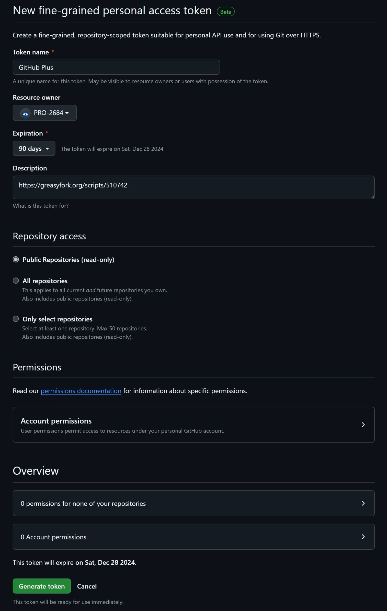

 

> If you encounter issues reading Greasy Fork's README, please visit the [README on GitHub](https://github.com/PRO-2684/gadgets/blob/main/github_plus/README.md) for a better experience.

## 🪄 Features & Configuation

- **Personal Access Token** (PAT): Your personal access token for GitHub API, starting with `github_pat_` (used for increasing rate limit).
    - Without a PAT, only $60$ requests per hour are allowed; with a PAT, $5000$ requests per hour are allowed, which suffices for most users.
    - Find out how to create a fine-grained personal access token [here](https://docs.github.com/en/authentication/keeping-your-account-and-data-secure/managing-your-personal-access-tokens#creating-a-fine-grained-personal-access-token).
    - Simply select `Public Repositories (read-only)` under `Repository access` tab, which is the default setup. An example image will be shown on the [Screenshots](#-screenshots) section.
    - Do note that this script won't be able to add additional information on private repositories.
    - Remember to *generate a new token when it expires*.
- **Debug**: Enable debug mode.
- **Release Downloads**: Show how many times a release asset has been downloaded.
- **Release Uploader**: Show who uploaded a release asset.

## 🖼️ Screenshots

Example "Assets" section of [a release](https://github.com/microsoft/terminal/releases/tag/v1.22.2702.0) on GitHub, with `Release Downloads` and `Release Uploader` enabled:

Example setup for personal access token:

## 🤔 Known Issues

- The added information might not align well.
