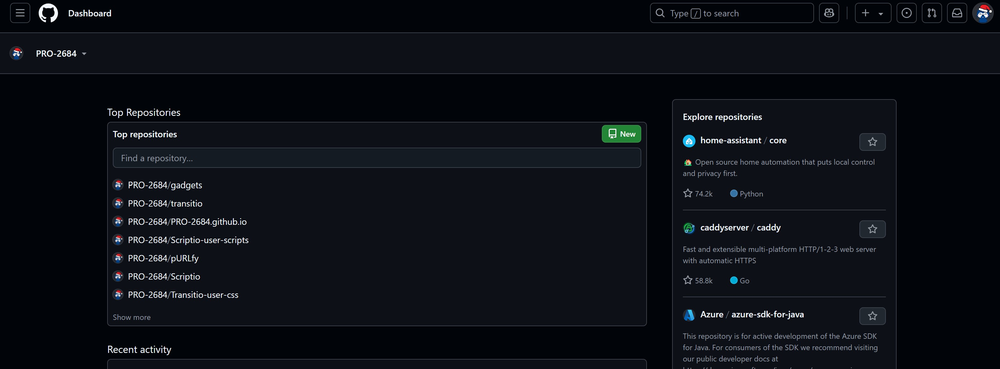

 

> If you encounter issues reading Greasy Fork's README, please visit the [README on GitHub](https://github.com/PRO-2684/gadgets/blob/main/github_plus/README.md) for a better experience.

## 🪄 Features

- No use of `MutationObserver` or `setInterval`, purely event-driven, making it more efficient than scripts of similar functionality
- No dangerous monkey patching, ensuring compatibility
- Experimental support for all GitHub mirrors
    - You need to add the mirror site to **this script's `User matches` list**
    - `Dashboard` - `Installed Userscripts` - `GitHub Plus` - `Settings` - `Includes/Excludes` - `User matches` - `Add...`

## ⚙️ Configuation

- **🔢 Code Features**
    - **📥 Clone Full Command**: Append `git clone ` before `https` and `git@` URLs under the code tab. (Experimental, may or may not work)
    - **➡️ Tab Size**: Set Tab indentation size.
    - **😉 Cursor Blink**: Enable cursor blinking.
    - **🌊 Cursor Animation**: Make cursor move smoothly.
- **🎨 Appearance**
    - **📰 Dashboard**: Configures the dashboard (`Default`, `Hide Copilot`, `Hide Feed`, `Mobile-Like`)
    - **↖️ Left Sidebar**: Configures the left sidebar (`Default`, `Hidden`)
    - **↗️ Right Sidebar**: Configures the right sidebar (`Default`, `Hide 'Latest changes'`, `Hide 'Explore repositories'`, `Hide Completely`)
- **📦 Release Features**
    - **⬆️ Release Uploader**: Show uploader of release assets.
    - **📥 Release Downloads**: Show download counts of release assets.
    - **📊 Release Histogram**: Show a histogram of download counts for each release asset.
        - Does not show up if there is only zero or one release asset.
        - Does not show up if none of the release assets have been downloaded.
- **🪄 Additional Features**
    - **🎭 Tracking Prevention**: Prevents some tracking by GitHub.
- **⚙️ Advanced Settings**
    - **🔑 Personal Access Token**: Your personal access token for GitHub API, starting with `github_pat_` (used for increasing rate limit). For more information, see the [Personal Access Token (PAT)](#-personal-access-token-pat) section.
    - **📈 Rate Limit**: View the current rate limit status.
    - **🐞 Debug**: Enable debug mode.

## 🖼️ Showcases

Example "Assets" section

Example "Assets" section of [a release](https://github.com/microsoft/terminal/releases/tag/v1.22.2702.0) on GitHub, with `Release Downloads`, `Release Uploader` and `Release Histogram` enabled

Example Dashboard

Example Dashboard, with `📰 Dashboard` set to `Mobile-Like`, `↖️ Left Sidebar` set to `Hidden` and `↗️ Right Sidebar` set to `Hide 'Latest changes'`.

## 🔑 Personal Access Token (PAT)

- Without a PAT, only $60$ requests per hour are allowed; with a PAT, $5000$ requests per hour are allowed, which suffices for most users.
- Find out how to create a fine-grained personal access token [here](https://docs.github.com/en/authentication/keeping-your-account-and-data-secure/managing-your-personal-access-tokens#creating-a-fine-grained-personal-access-token).
- Simply select `Public Repositories (read-only)` under `Repository access` tab, which is the default setup. An example image is shown below for reference.
- Do note that this script won't be able to add additional information on private repositories.
- Remember to *generate a new token when it expires*.
- Use a personal access token on a mirror site at your own risk.

Example setup for personal access token

## 💡 Mechanism

> For more detailed information, please refer to the source code. It is (hopefully) well-commented and contains other explanations and insights that may not be covered here.

### `Release *` Features

- First, we need to listen for `DOMContentLoaded` and `turbo:load` events to know when DOM is ready or there has been a content change. In both cases, we need to re-check the page (`setupListeners`).
- Then, we should find all release-related `include-fragment` elements. By using devtools, we learn that they will be dynamically replaced with the actual content, so it's vital to investigate them.
- Search GitHub and we can find [the repo for `include-fragment`](https://github.com/github/include-fragment-element/) with documentation. We can learn from the documentation that a `include-fragment` element will dispatch a `include-fragment-replace` event, just after the content has been fetched and parsed, and before it's inserted into the DOM. Better still, it comes with a handy `detail.fragment` property of type [`DocumentFragment`](https://developer.mozilla.org/en-US/docs/Web/API/DocumentFragment), which is the parsed content.
- So, for each `include-fragment` element, we listen for the `include-fragment-replace` event and then process the `detail.fragment` to add our additional information (`onFragmentReplace`).
- In order to query additional information for a given release, we simply call the ["Get a release by tag name" API](https://docs.github.com/en/rest/releases/releases?apiVersion=2022-11-28#get-a-release-by-tag-name). We can then extract the information we need and add it to the `DocumentFragment`.

### `Tracking Prevention` Feature

By investigating source code (thanks for the source mapping) and setting breakpoints, we can find out that GitHub initializes tracking endpoints from certain `<meta>` tags. By removing these tags, we can prevent some tracking. For more details, please refer to the source code, or read [this thread (in Chinese)](https://www.52pojie.cn/forum.php?mod=viewthread&tid=1969514).

## 🤔 Known Issues

- The added information might not align well.
- You might see a "Error Looks like something went wrong!" banner if "Tracking Prevention" is enabled.
