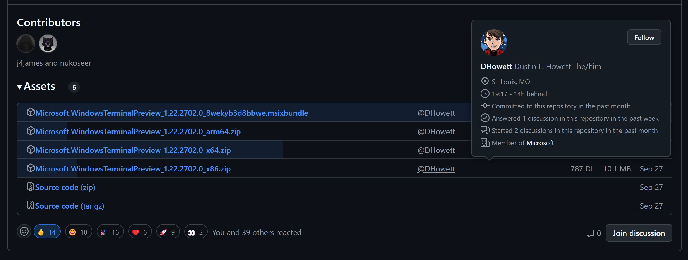
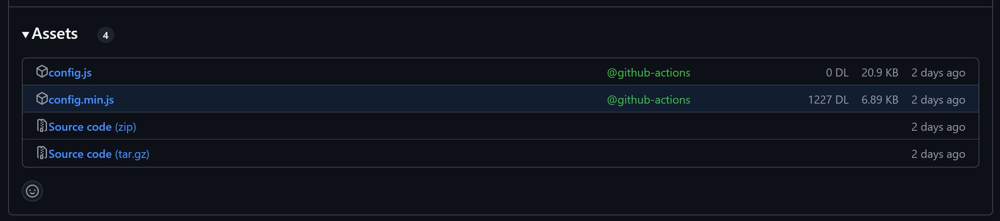
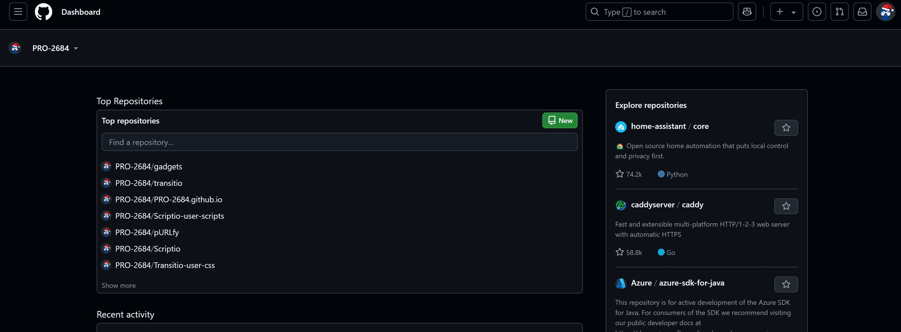
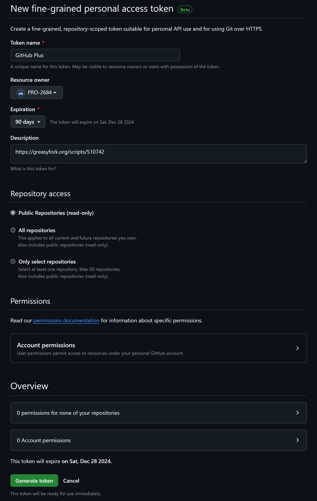

 

> 如果你在 Greasy Fork 上查看自述文件时遇到问题，请访问 [GitHub 上的自述文件](https://github.com/PRO-2684/gadgets/blob/main/github_plus/README_CN.md) 以获得更好的体验。

## 🪄 特点

- 不使用 `MutationObserver` 或 `setInterval`，纯粹基于事件驱动，比类似功能的脚本更高效
- 没有危险的动态修补，确保兼容性
- 实验性支持各种 GitHub 镜像站
    - 需自行将镜像站添加到**此脚本的 `用户匹配` 列表**
    - `管理面板` - `已安装脚本` - `GitHub 增强` - `设置` - `包括/排除` - `用户匹配` - `添加...`

## ⚙️ 配置

- **🔢 Code Features**
    - **📥 Clone Full Command**: 在代码标签下的 `https` 和 `git@` URL 前附加 `git clone `。(实验性功能，可能有效也可能无效)
    - **➡️ Tab Size**: 设置 Tab 缩进大小。
    - **😉 Cursor Blink**: 启用光标闪烁。
    - **🌊 Cursor Animation**: 使光标平滑移动。
- **🎨 Appearance**
    - **📰 Dashboard**: 配置仪表盘。(`Default`, `Hide Copilot`, `Hide Feed`, `Mobile-Like`)
    - **↖️ Left Sidebar**: 配置左侧栏。(`Default`, `Hidden`)
    - **↗️ Right Sidebar**: 配置右侧栏。(`Default`, `Hide 'Latest changes'`, `Hide 'Explore repositories'`, `Hide Completely`)
    - **📌 Sticky Avatar**: 使头像固定。(实验性功能，不适用于所有头像)
- **📦 Release Features**
    - **⬆️ Release Uploader**: 显示 Release 中文件的上传者。
        - 如果上传者是用户，则悬停时显示用户悬停卡片。
        - 如果上传者是 GitHub App，则着色为绿。
    - **📥 Release Downloads**: 显示 Release 中文件的下载次数。
    - **📊 Release Histogram**: 显示 Release 中各文件的下载次数直方图。
        - 如果只有零个或一个 Release 文件，则不会显示。
        - 如果没有任何 Release 文件被下载，则不会显示。
- **🪄 Additional Features**
    - **🎭 Tracking Prevention**: 阻止 GitHub 的一些跟踪。
- **⚙️ Advanced Settings**
    - **🔑 Personal Access Token**: GitHub API 的个人访问令牌，以 `github_pat_` 开头（用于提升速率限制）。详见 [个人访问令牌 (PAT)](#-个人访问令牌-pat) 部分。
    - **📈 Rate Limit**: 查看当前速率限制状态。
    - **🐞 Debug**: 启用调试模式。

## 🖼️ 效果展示

"Assests" 部分示例

下述 Release "Assests" 部分的示例均启用了 `Release Downloads`, `Release Uploader` 和 `Release Histogram`。

[microsoft/terminal@v1.22.2702.0](https://github.com/microsoft/terminal/releases/tag/v1.22.2702.0):

[PRO-2684/GM_config@v1.2.1](https://github.com/PRO-2684/GM_config/releases/tag/v1.2.1):

仪表盘示例

这是一个仪表盘界面的示例，其中 `📰 Dashboard` 设置为 `Mobile-Like`, `↖️ Left Sidebar` 设置为 `Hidden`, `↗️ Right Sidebar` 设置为 `Hide 'Latest changes'`。

## 🔑 个人访问令牌 (PAT)

- 没有 PAT，每小时只允许 $60$ 次请求；有 PAT，每小时允许 $5000$ 次请求，对大多数用户来说足够了。
- [在这里](https://docs.github.com/en/authentication/keeping-your-account-and-data-secure/managing-your-personal-access-tokens#creating-a-fine-grained-personal-access-token) 了解如何创建细粒度的个人访问令牌。
- 在 `Repository access` 选项卡下只需选择 `Public Repositories (read-only)`（默认设置）。此部分后面展示了一张示例图片，以供参考。
- 请注意，此脚本无法在私有仓库上添加额外信息。
- 记得 *在令牌过期时生成一个新令牌*。
- 自行承担在镜像站上使用个人访问令牌的风险。

个人访问令牌示例设置

## 💡 机制

> 有关更详细的信息，请参阅源代码。（希望）它有很好的注释，并包含其他可能未在此处涵盖的说明与见解。

### `Release *` 功能

- 首先，我们需要监听 `DOMContentLoaded` 和 `turbo:load` 事件，以了解 DOM 何时准备就绪或内容发生更改。在这两种情况下，我们都需要重新检查页面（`setupListeners`）。
- 然后，我们应该找到所有与 Release 相关的 `include-fragment` 元素。通过使用开发者工具，我们了解到它们将动态地被实际内容替换，因此调查它们至关重要。
- 搜索 GitHub，我们可以找到 [`include-fragment` 的仓库](https://github.com/github/include-fragment-element/)，其中包含文档。我们可以从文档中了解到，`include-fragment` 元素将在内容被获取并解析后、插入到 DOM 之前派发一个 `include-fragment-replace` 事件。更好的是，它带有一个方便的类型为 [`DocumentFragment`](https://developer.mozilla.org/en-US/docs/Web/API/DocumentFragment) 的属性 `detail.fragment`，亦即解析后的内容。
- 因此，对于每个 `include-fragment` 元素，我们监听 `include-fragment-replace` 事件，然后处理 `detail.fragment` 以添加我们的额外信息（`onFragmentReplace`）。
- 为了查询给定 Release 的额外信息，我们只需调用 ["Get a release by tag name" API](https://docs.github.com/en/rest/releases/releases?apiVersion=2022-11-28#get-a-release-by-tag-name)。然后，我们可以提取我们需要的信息并将其添加到 `DocumentFragment` 中。

### `Tracking Prevention` 功能

通过调查源代码（感谢源代码映射）并设置断点，我们可以发现 GitHub 从某些 `<meta>` 标签初始化跟踪端点。通过移除这些标签，我们可以阻止一些跟踪。更多细节可以参阅源代码，或阅读 [这篇帖子](https://www.52pojie.cn/forum.php?mod=viewthread&tid=1969514)。

## 🤔 已知问题

- 添加的信息可能不对齐。
- 如果启用了 "Tracking Prevention"，则可能会看到一个 "Error Looks like something went wrong!" 横幅。
