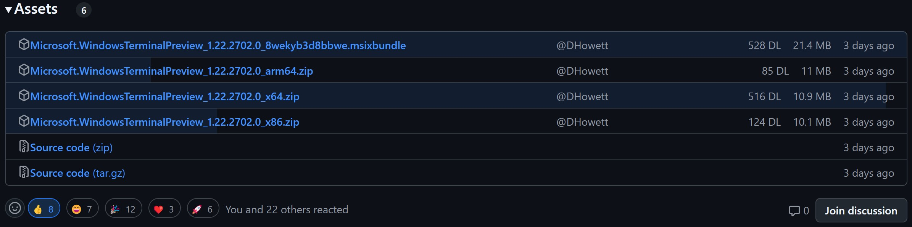
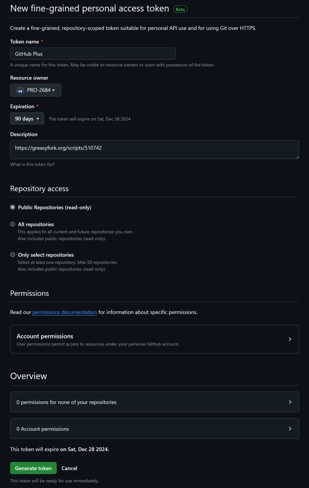

 

> 如果你在 Greasy Fork 上查看自述文件时遇到问题，请访问 [GitHub 上的自述文件](https://github.com/PRO-2684/gadgets/blob/main/github_plus/README_CN.md) 以获得更好的体验。

## 🪄 特点

- 不使用 `MutationObserver` 或 `setInterval`，纯粹基于事件驱动，比类似功能的脚本更高效
- 没有危险的动态修补，确保兼容性

## ⚙️ 配置

- **📦 Release Features**
    - **Release Downloads**: 显示 Release 中文件的下载次数。
    - **Release Uploader**: 显示 Release 中文件的上传者。
    - **Release Histogram**: 显示 Release 中文件的下载次数直方图。
        - 如果只有零个或一个 Release 文件，则不会显示。
        - 如果没有任何 Release 文件被下载，则不会显示。
- **🪄 Additional Features**
    - **Tracking Prevention**: 阻止 GitHub 的一些跟踪。
- **⚙️ Advanced Settings**
    - **Personal Access Token**: GitHub API 的个人访问令牌，以 `github_pat_` 开头（用于提升速率限制）。详见 [个人访问令牌 (PAT)](#-个人访问令牌-pat) 部分。
    - **Debug**: 启用调试模式。

## 🖼️ 效果展示

GitHub 上 [一个 Release](https://github.com/microsoft/terminal/releases/tag/v1.22.2702.0) "Assests" 部分的示例，启用了 `Release Downloads`, `Release Uploader` 和 `Release Histogram`：

## 🔑 个人访问令牌 (PAT)

- 没有 PAT，每小时只允许 $60$ 次请求；有 PAT，每小时允许 $5000$ 次请求，对大多数用户来说足够了。
- [在这里](https://docs.github.com/en/authentication/keeping-your-account-and-data-secure/managing-your-personal-access-tokens#creating-a-fine-grained-personal-access-token) 了解如何创建细粒度的个人访问令牌。
- 在 `Repository access` 选项卡下只需选择 `Public Repositories (read-only)`（默认设置）。此部分后面展示了一张示例图片，以供参考。
- 请注意，此脚本无法在私有仓库上添加额外信息。
- 记得 *在令牌过期时生成一个新令牌*。

个人访问令牌的示例设置：

## 💡 机制

> 有关更详细的信息，请参阅源代码。（希望）它有很好的注释，并包含其他可能未在此处涵盖的说明与见解。

### `Release *` 功能

- 首先，我们需要监听 `DOMContentLoaded` 和 `turbo:load` 事件，以了解 DOM 何时准备就绪或内容发生更改。在这两种情况下，我们都需要重新检查页面（`setupListeners`）。
- 然后，我们应该找到所有与 Release 相关的 `include-fragment` 元素。通过使用开发者工具，我们了解到它们将动态地被实际内容替换，因此调查它们至关重要。
- 搜索 GitHub，我们可以找到 [`include-fragment` 的仓库](https://github.com/github/include-fragment-element/)，其中包含文档。我们可以从文档中了解到，`include-fragment` 元素将在内容被获取并解析后、插入到 DOM 之前派发一个 `include-fragment-replace` 事件。更好的是，它带有一个方便的类型为 [`DocumentFragment`](https://developer.mozilla.org/en-US/docs/Web/API/DocumentFragment) 的属性 `detail.fragment`，亦即解析后的内容。
- 因此，对于每个 `include-fragment` 元素，我们监听 `include-fragment-replace` 事件，然后处理 `detail.fragment` 以添加我们的额外信息（`onFragmentReplace`）。
- 为了查询给定 Release 的额外信息，我们只需调用 ["Get a release by tag name" API](https://docs.github.com/en/rest/releases/releases?apiVersion=2022-11-28#get-a-release-by-tag-name)。然后，我们可以提取我们需要的信息并将其添加到 `DocumentFragment` 中。

### `Tracking Prevention` 功能

通过调查源代码（感谢源代码映射）并设置断点，我们可以发现 GitHub 从某些 `<meta>` 标签初始化跟踪端点。通过移除这些标签，我们可以阻止一些跟踪。更多细节可以参阅源代码，或阅读 [这篇帖子](https://www.52pojie.cn/forum.php?mod=viewthread&tid=1969514)。

## 🤔 已知问题

- 添加的信息可能不对齐。
