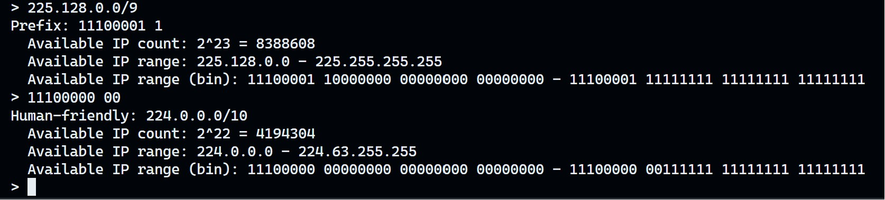

# `subnet_helper`

## 🪄 Function
Converts binary subnet mask to human-friendly notation (dot-decimal with length) and vice versa. In addition, it can provide available IP range and count in the given subnet.

[Online version (Chinese)](https://pro-2684.github.io/?page=subnet)

## 📖 Usage
- `python3 ./subnet_helper.py`
- Input a subnet mask in binary or a human-friendly notation
- Press `Enter` to get the result
- Press `Ctrl+C` to exit

## 🍻 Example

```bash
$ python3 ./subnet_helper.py
> 225.128.0/9
Prefix: 11100001 1
  Available IP count: 2^23 = 8388608
  Available IP range: 225.128.0.0 - 225.255.255.255
  Available IP range (bin): 11100001 10000000 00000000 00000000 - 11100001 11111111 11111111 11111111
> 11100000 00
Human-friendly: 224.0.0.0/10
  Available IP count: 2^22 = 4194304
  Available IP range: 224.0.0.0 - 224.63.255.255
  Available IP range (bin): 11100000 00000000 00000000 00000000 - 11100000 00111111 11111111 11111111
>
```

Screenshot:



If you have `rich` module installed, you can get a colored output:


