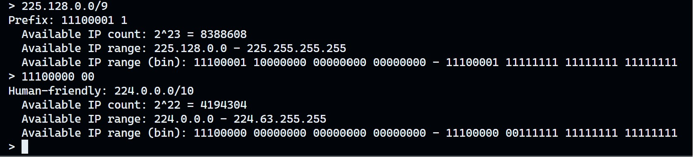
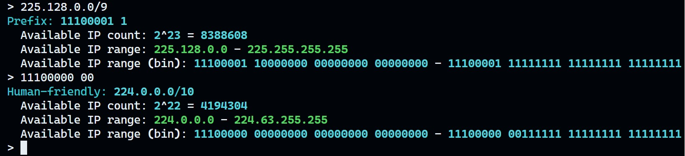

# `subnet_helper`

## 🪄 功能
将二进制子网掩码转换为人类可读的表示法（点十进制表示法加长度），反之亦然。此外，它还可以提供给定子网中的可用 IP 范围和数量。

## 📖 使用方法
- `python3 ./subnet_helper.py`
- 输入二进制子网掩码或人类可读的表示法
- 按 `Enter` 键获取结果
- 按 `Ctrl+C` 退出

## 🍻 例子

```bash
$ python3 ./subnet_helper.py
> 225.128.0/9
Prefix: 11100001 1
  Available IP count: 2^23 = 8388608
  Available IP range: 225.128.0.0 - 225.255.255.255
  Available IP range (bin): 11100001 10000000 00000000 00000000 - 11100001 11111111 11111111 11111111
> 11100000 00
Human-friendly: 224.0.0.0/10
  Available IP count: 2^22 = 4194304
  Available IP range: 224.0.0.0 - 224.63.255.255
  Available IP range (bin): 11100000 00000000 00000000 00000000 - 11100000 00111111 11111111 11111111
>
```

截图:



如果你安装了 `rich` 模块，你可以得到彩色的输出:


