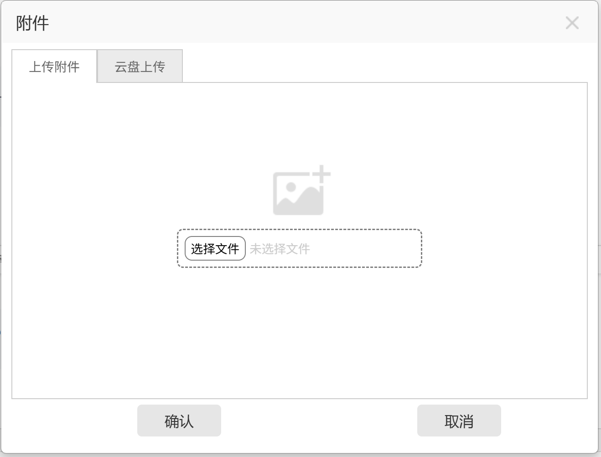

# UCAS Helper

## 🪄 Functions

- [🔑 SEP](https://sep.ucas.ac.cn/)
    - 🔐 Auto login*: Choose auto login strategy, works best with browser auto-fill
        - `None`: Do nothing
        - `Focus`: Focus on the first unfilled field (username, password or captcha), or the submit button if all filled
        - `Auto`: Automatically submit the form when all fields are filled, otherwise focus on the first unfilled field; Not working due to browser security policy
    - 🧼 Cleaner UI: Make the navigation page cleaner
    - 📂 Extended entries: Add more entries in  flyout menus
        - `课程` - `在线学习`
            - [考勤系统](https://sep.ucas.ac.cn/portal/site/539/001/1)
- [🪶 Course Selection](http://xkgo.ucas.ac.cn:3000/courseManage/selectCourse)
    - 📃 Assistive course selection
        - Configure your list of course IDs, or simply follow them
        - When the result contains your desired courses, this script will:
            1. Checks if they are available
            2. If available, it will check them and invert its color for you
            3. If at least one is available, it will focus on the captcha input and mark it red
    - 🟢 Keep Alive
- [🎓 MOOC](https://i.mooc.ucas.edu.cn/space/index.shtml)
    - 📂 Native selector: Use the native file selector instead of the custom one, allowing drag-and-drop

## 🖼️ Screenshots

### Native selector

